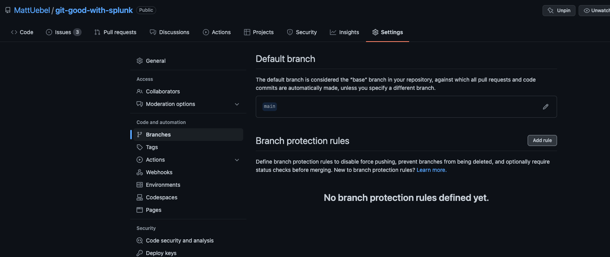
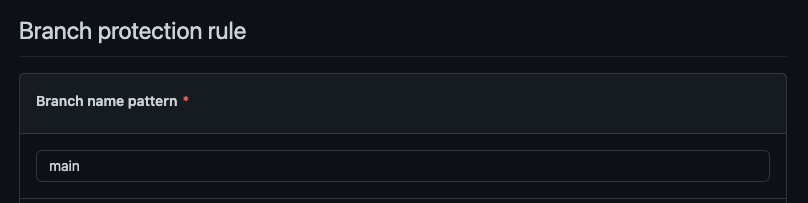
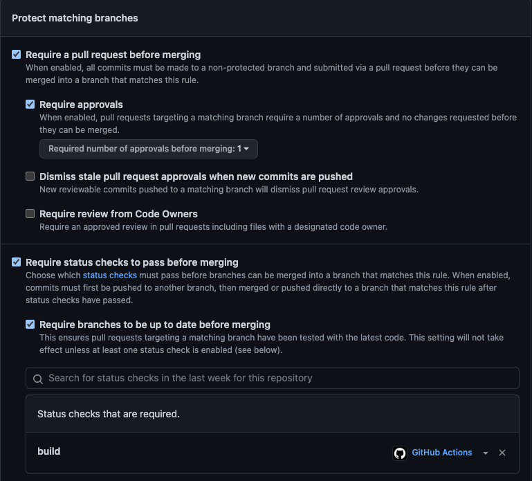

## Setup Branch Protection for a Repository

To take advantage of status checks, you'll need to set up branch protection rules for your default branch (usually `main`).

---

### Navigate to `Settings` -> `Branches` and then click `Add rule`

  

---

### Now in the Branch Protection Rule settings, add a name pattern (again, usually `main`)

  

---

### One section down, update `Protect matching branches` to require a PR before merging, approvals, and that status checks pass before merging. It's also helpful to require branches to be up to date before merging (that they have any new commits added to main). Select the `build` status check as the check that must pass.

---

### Click `Save changes` to put the rule in place.